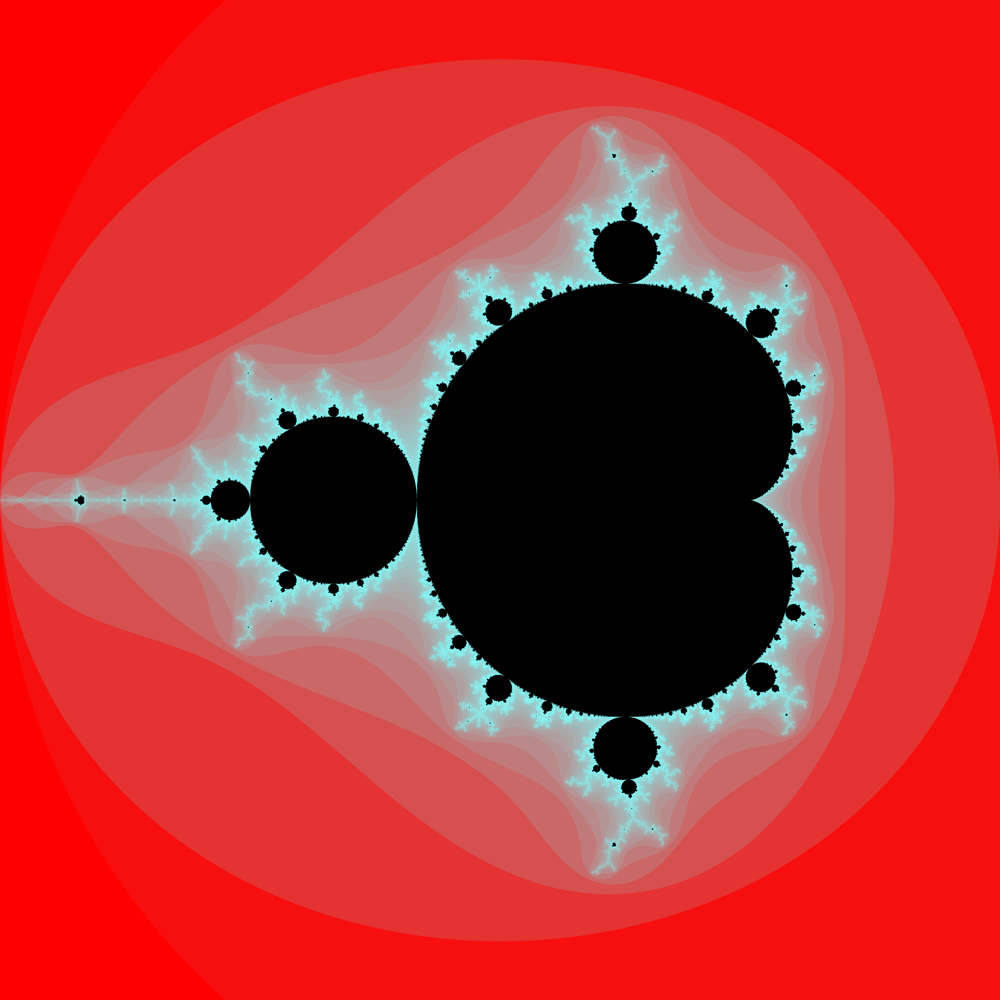

# Fractals

## Mandelbrot

My python mandelbrot is pretty cool and you can find it here: <https://github.com/apksqrd/Math-Challenges/blob/main/mandelbrot.py>

This is the rust-generated one:

TODO: change the Option type thing for default settings, just make it a macro
TODO: Julia sets (combine Julia and mandelbrot)
TODO: implement buddhabrot
TODO: implement more fractals from [3B1B](https://www.youtube.com/watch?v=LqbZpur38nw&t=31s)
TODO: Chaos game
TODO: L-system
TODO: Include extra information in outputs (such as logging the time taken and the parameters)
TODO: Logistic map
